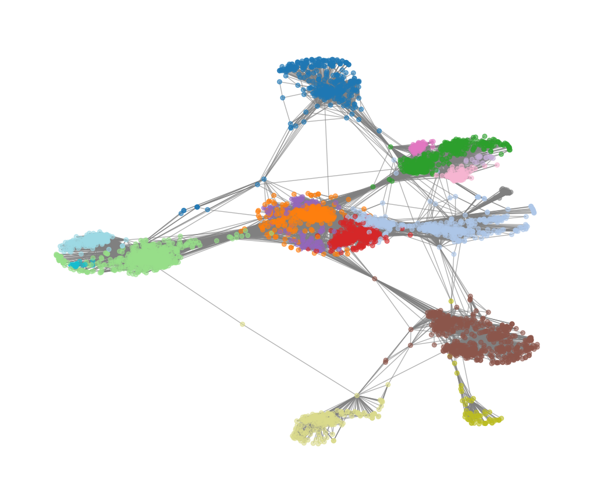

# Social Network Loneliness Intervention: Targeted Rewiring vs Random Edge Addition


> **Can we algorithmically reduce social isolation by strategically rewiring a social network?**
> This project answers that question using the Stanford SNAP Facebook dataset and two competing intervention strategies.

---

## Overview

Social isolation disproportionately affects individuals at the periphery of network structures — those with few connections and little overlap between their friends. This study implements and compares two network intervention strategies designed to improve the social embeddedness of these **"left-behind" nodes**:

| Strategy | Description |
|---|---|
| **Targeted Rewiring** | Connects each isolated node to the most structurally similar peer *within its own community* (ranked by Jaccard similarity) |
| **Random Edge Addition** | Adds the same number of edges, but between randomly selected node pairs (serves as the control) |

The primary metric is the **local clustering coefficient** of peripheral nodes — a proxy for how tightly embedded an individual is within a friend group.

---

## Key Results

| Metric | Targeted | Random |
|---|---|---|
| Mean ΔC (clustering gain) | **0.0969** | 0.0109 |
| Std Dev | 5.1 × 10⁻⁴ | 8.7 × 10⁻⁴ |
| Paired t-test | *t*(29) = 44.87 | *p* = 2.39 × 10⁻²⁸ |
| Cohen's d (effect size) | **8.19** (extremely large) | — |
| Left-behind nodes after 5 rounds | **0** | ~17 median |
| ASPL change | −0.04% (preserved) | −0.17% |

The targeted strategy **outperforms random rewiring by ~9×** in clustering gain and completely eliminates the isolated set within 5 rounds, while preserving the network's small-world topology.

---

## How It Works

### 1. Left-Behind Node Identification
Nodes are flagged as *left-behind* (L) if they fall below the 20th percentile in **both** degree and local clustering coefficient:

```
L = { v ∈ V | deg(v) < Q₀.₂(degree) AND clust(v) < max(0.1, Q₀.₂(clustering)) }
```

### 2. Community Detection
[Louvain algorithm](https://python-louvain.readthedocs.io/) detects communities by optimising modularity Q. Communities are recomputed each round so the strategy adapts as the network evolves.

### 3. Connection Suggestion (Targeted)
For each left-behind node `u`, the algorithm:
1. Finds intra-community candidates not yet connected to `u`
2. Ranks them by **Jaccard similarity**: `J(u,v) = |N(u) ∩ N(v)| / |N(u) ∪ N(v)|`
3. Falls back to cross-community candidates only if `k` suggestions cannot be filled

### 4. Statistical Validation
Results are averaged over **50 independent runs** (each with a different random seed) and compared using a **paired-sample t-test** with Cohen's d effect size.

---

## Project Structure

```
social-network-loneliness-intervention/
├── network_intervention.py     # Main simulation script
├── requirements.txt            # Python dependencies
├── paper/
│   └── network_intervention_report.pdf   # Full academic report
├── figures/                    # Output plots (A–L)
├── data/
│   └── README.md               # Instructions to download the dataset
├── .gitignore
└── README.md
```

---

## Getting Started

### Prerequisites
- Python 3.8+
- The Facebook SNAP dataset (see [Data](#data) section)

### Installation

```bash
git clone https://github.com/alinjfz/social-network-loneliness-intervention.git
cd social-network-loneliness-intervention
pip install -r requirements.txt
```

### Data

Download `facebook_combined.txt` from the [Stanford SNAP repository](https://snap.stanford.edu/data/ego-Facebook.html) and place it in the project root:

```bash
# Direct download
curl -o facebook_combined.txt.gz https://snap.stanford.edu/data/facebook_combined.txt.gz
gunzip facebook_combined.txt.gz
```

### Run

```bash
python network_intervention.py
```

This will:
1. Load the Facebook network
2. Run `R=3` experiment rounds (change to `R=50` for full results)
3. Save all figures to `figures/`
4. Print statistical summary to console

**Output example:**
```
Graph loaded: V=4,039, E=88,234
delta C targeted  mean=0.0969
delta C random    mean=0.0109
paired t-test t=44.87,  p=2.39e-28
```

---

## Configuration

Key parameters at the top of `network_intervention.py`:

| Parameter | Default | Description |
|---|---|---|
| `Q` | 0.20 | Quantile threshold for left-behind identification |
| `CLUST_FLOOR` | 0.1 | Minimum clustering threshold |
| `N_ROUNDS` | 5 | Number of intervention rounds |
| `MAX_EDGES_ROUND` | 200 | Max edges added per round |
| `K_SUGG_PER_NODE` | 5 | Suggestions per left-behind node |
| `SEED` | 42 | Global random seed |

---

## Dataset

**Facebook Social Circles**, Stanford SNAP
Leskovec & McAuley, NeurIPS 2012
- Nodes: 4,039 (anonymised Facebook users)
- Edges: 88,234 (undirected friendships)
- Global clustering coefficient: ~0.605
- Average shortest path length: ~3.69

---

## Figures

All figures are available in [`paper/network_intervention_report.pdf`](paper/network_intervention_report.pdf).

- Clustering distribution of peripheral nodes at baseline
- Paired comparison of clustering gains (targeted vs random)
- Mean clustering of left-behind nodes over successive intervention rounds
- Scatterplot of edges added vs resulting clustering gain
- ASPL, clustering, edges, and left-behind counts per iteration



---

## Dependencies

See [requirements.txt](requirements.txt). Core libraries:

- `networkx` — graph construction and metrics
- `python-louvain` — Louvain community detection
- `numpy`, `scipy` — numerical computation and statistics
- `matplotlib`, `seaborn` — visualisation

---

## Academic Report

The full methodology, results, and discussion are in [`paper/network_intervention_report.pdf`](paper/network_intervention_report.pdf).

---

## License

This project is licensed under the [MIT License](LICENSE).

---

## Author

**Ali Najafzadeh**
MSc Artificial Intelligence, University of Sussex
[GitHub](https://github.com/alinjfz)
